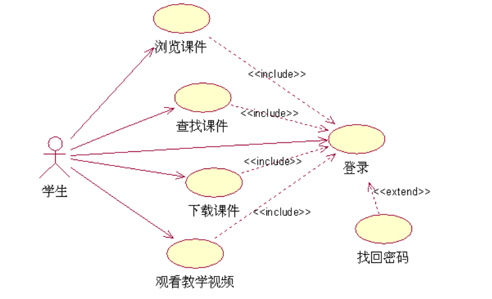
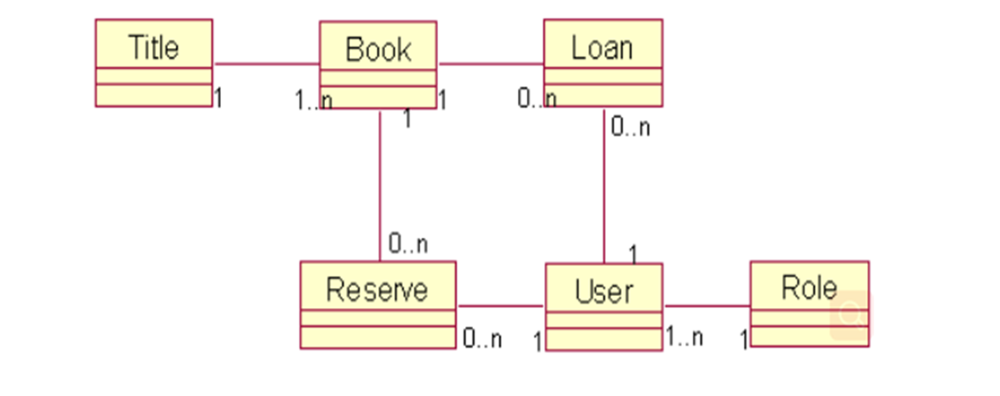
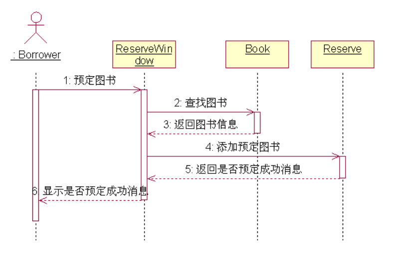

1、功能需求如下：
1）学生登录网站后，可以浏览课件、查找课件、下载课件、观看教学视频
2）教师登录网站后，可以上传课件，上传教学视频，发布教学心得、查看教学心得、修改教学心得

若学生需要登录系统后才能正常使用该系统的所有功能。

如果忘记密码，可以通过“找回密码”功能恢复密码。

请画出学生参与者的用例图

2、图书管理系统功能性需求说明如下: 
（1）图书管理系统能够为一定数量的借阅者提供服务。每个借阅者能够拥有唯一标识其存在的编号。图书馆向每一个借阅者发放图书证，其中包含每一个借阅者的编号和个人信息。提供的服务包括：提供查询图书信息、查询个人信息服务和预定图书服务等。 
（2）当借阅者需要借阅图书、归还书籍时需要通过图书管理员进行，即借阅者不直接与系统交互，而是通过图书管理员充当借阅者的代理和系统交互。
（3）系统管理员主要负责系统的管理维护工作，包括对图书、数目、借阅者的添加、删除和修改。并且能够查询借阅者、图书和图书管理员的信息。 
（4）可以通过图书的名称或图书的ISBN/ISSN号对图书进行查找。
回答下面问题：
 (1)该系统中有哪些参与者?
 (2)确定该系统中的类，找出类之间的关系并画出类图
 (3)画出语境“借阅者预定图书”的顺序图

参与者：借阅者、图书管理员、系统管理员

