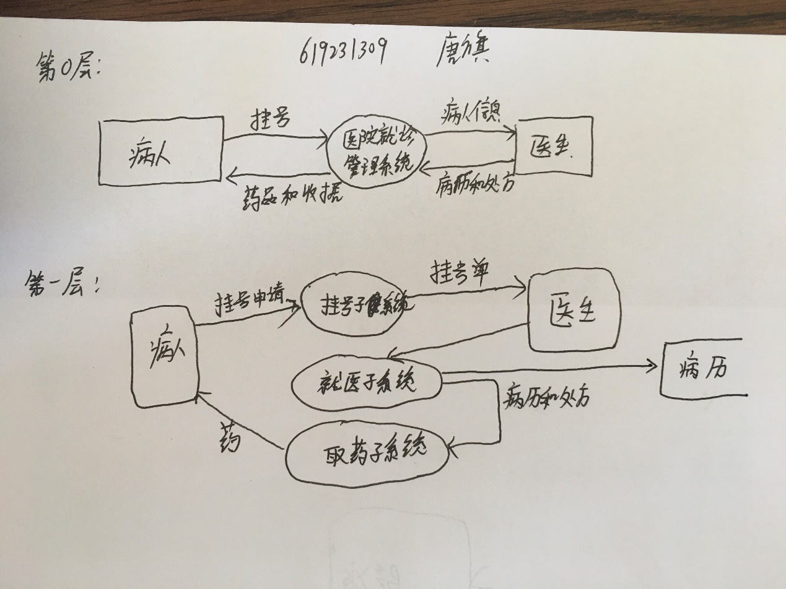
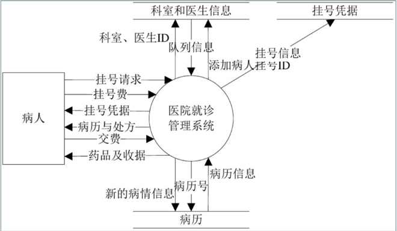
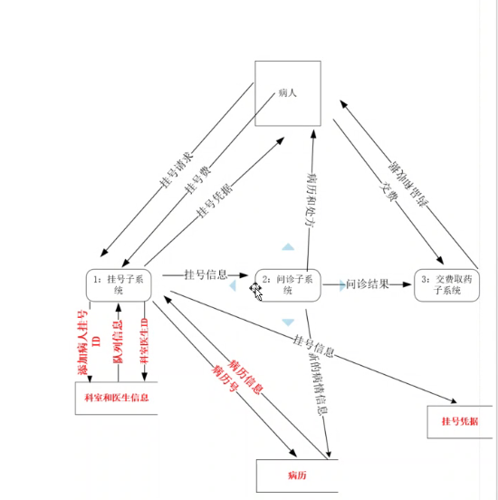
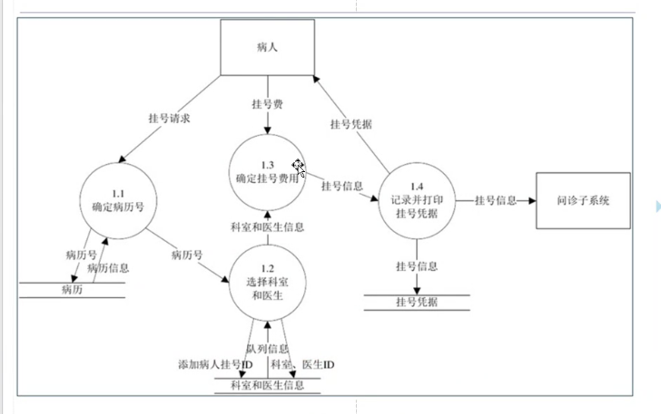
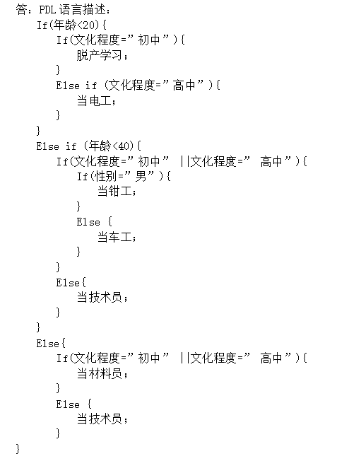
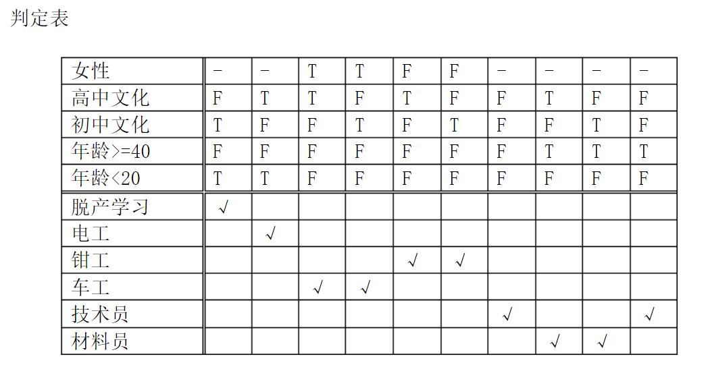
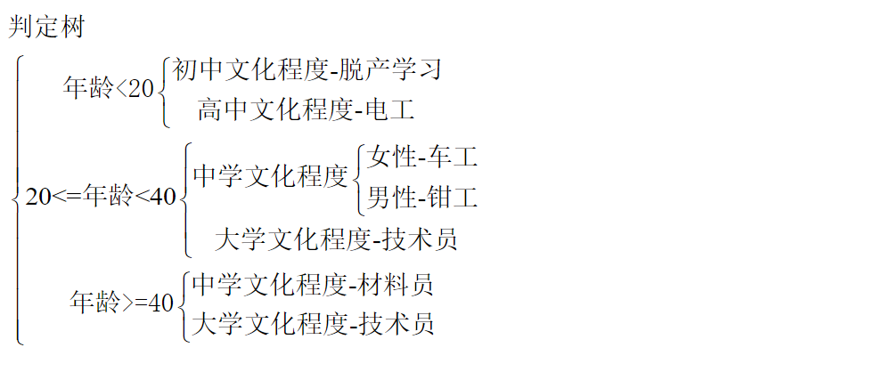
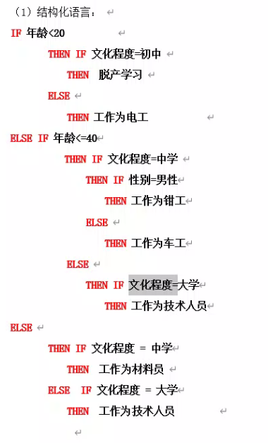

1、医院就诊管理系统：假设，该系统设计医院的三个部分：挂号、问诊、交费和取药
**挂号：**

 	1. 挂号处的挂号人员接受病人的就诊请求，
 	2. 根据门诊科室各医生的病人的排队情况，
 	3. 分配合适的科室和医生，
 	4. 记录并打印挂号凭据，
 	5. 收取挂号费完成挂号请求

**问诊：**

1. 医生根据挂号的次序对病人进行病情诊断，
2. 根据挂号单据及病历号获取该病人的历史病例，
3. 然后将问诊结果记录在病历当中并开具相应的处方（处方可根据系统提供的药品进行选择），
4. 打印处方交给病人完成一次问诊。

**交费取药：**

1. 病人在收费处根据挂号单据和处方所列出的药品种类和数量进行交费，

2. 取得相应的药品完成一次看病流程。

请利用结构化分析方法（数据流图）对上述案例进行需求分析，要求画出顶层数据流图、第0层数据流图以及任意一个第1层数据流图。

结构化语言

顶层数据流图：

第0层（或叫第一层）数据流图答案：

 

第1层（或叫第二层）数据流图答案

 

 

2、某厂对部分职工重新分配工作的政策是：年龄在20岁以下者，初中文化程度脱产学习，高中文化程度当电工。20岁至40岁之间，中学文化程度，男性当钳工，女性当车工，大学文化程度都当技术员。年龄在40岁以上者，中学文化程度当材料员，大学文化程度当技术员。请用结构化语言﹑判定树（或判定表，二者选其一）两种方式描述上述问题的加工逻辑。

 

 
