第一章  软件工程概念

授课老师：清华大学计算机系 殷人昆
yinrk432@sina.com 

**提示：设计与建模要点** 

结构化分析建模：数据流图、实体关系图、状态迁移图、数据字典
结构化设计建模：数据流图转换为系统结构图
结构化程序设计：程序流程图、N-S图、PAD
程序环路复杂性计算
测试用例设计：逻辑覆盖、循环测试、基本路径覆盖、因果图
可靠性分析：估算测试前程序中潜在错误
OMT建模：对象模型、动态模型（状态图、事件追踪图）
UML建模：用例图、类图、顺序图、活动图

## 第一章 软件工程概念

1.1  软件的定义与分类
1.2  软件的发展
1.3  软件工程定义
1.4  软件工程过程与软件生存周期模型
1.5  软件开发范型
1.6  软件工程原理和原则

### 1.1 软件的定义与分类

软件的定义：软件由计算机程序、数据及文档组成。
程序是按事先设计的功能和性能要求执行的指令序列
数据是使程序能正常操纵信息的数据结构
文档是与程序开发，维护和使用有关的图文材料
软件与硬件、数据库、人、过程等共同构成计算机系统。

####  软件的特点

软件是一种逻辑实体，而不是具体的物理实体。因而它具有抽象性
软件的生产与硬件不同，在它的开发过程中没有明显的制造过程
在软件的运行和使用期间，没有硬件那样的机械磨损，老化问题
软件的开发和运行常受到计算机系统的限制，对计算机系统有着不同程度的依赖性

软件的开发至今尚未完全摆脱手工艺的开发方式
软件本身是复杂的
实际问题的复杂性
程序逻辑结构的复杂性 
软件成本相当昂贵
相当多的软件工作涉及到社会因素

#### 软件的分类

软件的开发至今尚未完全摆脱手工艺的开发方式
软件本身是复杂的
实际问题的复杂性
程序逻辑结构的复杂性 
软件成本相当昂贵
相当多的软件工作涉及到社会因素

##### 按软件的功能进行划分：
 系统软件
 操作系统
 数据库管理系统
 设备驱动程序
 通信处理程序等
支撑软件
文本编辑程序
文件格式化程序

##### 程序库系统
支持需求分析、设计、实现、测试和支持管理的软件
 应用软件
 商业数据处理软件
 工程与科学计算软件
 计算机辅助设计／制造软件
 智能产品嵌入软件
 事务管理、办公自动化软件
 计算机辅助教学软件

##### 按软件规模进行划分：

​    类别    参加人员数     研制期限   源程序行数     
​    微型	     1	              1～4周          0.5k    
​    小型              1	              1～6月        1k～2k
​    中型           2～5	    1～2年        5k～50k
​    大型           5～20	    2～3年      50k～100k
  甚大型     100～1000        4～5年      1M(=1000k)
  极大型   2000～5000       5～10年      1M～10M	

##### 按软件工作方式划分：
 实时处理软件
 分时软件
 交互式软件
 批处理软件
##### 按软件服务对象的范围划分：
 项目软件
 产品软件

##### 按使用的频度进行划分：
 一次使用
 频繁使用
##### 按软件失效的影响进行划分：
 高可靠性软件
 一般可靠性软件

## 1.2  软件发展阶段

程序设计阶段  — 1950 至 60 年代
	计算机软件发展的初期，其主要特征是程序生产方式为个体手工方式。 
    主要采用批处理技术，没有任何其它形式的文档资料保留下来，开发出的程序根本无法维护。
程序系统阶段  — 60至70年代
	程序的规模已经很大，需要多人分工协作，软件的开发方式由“个体生产”发展到了“软件作坊”。

​	 “软件作坊”基本上沿用了软件发展早期所形成的个体化的开发方式，软件的开发与维护费用以惊人的速度增加。许多软件产品根本不能维护，最终导致出现了严重的“软件危机”。
软件工程阶段  — 70年代以后
​	软件的开发以工程化的思想为指导，用工程化的原则、方法和标准来开发和维护软件。
​	软件工程概念的出现源自软件危机。
​	软件危机的主要特征
 软件价格在整个项目投入中的比例不断升高; 

 软件开发成本严重超标;
 软件开发周期大大超过规定日期;
 软件质量难于保证；
 软件修改、维护困难；
 失败的根本原因在于：开发人员写出的东西达不到用户要求 (人的问题、技术问题)
为了解决软件危机，人们借鉴其他领域的经验和知识，从而认识到“摆脱软件危机的出路在于软件开发的标准化和工程化”，出现了“软件工程”的概念。

## 1.3 软件工程定义

1968 年德国人 Bauer 在北大西洋公约组织会议上的定义： "建立并使用完善的工程化原则 , 以较经济的手段获得能在实际机器上有效运行的可靠软件的一系列方法"。
1983 年 IEEE 的软件工程定义： "软件工程是开发，运行 , 维护和修复软件的系统方法"。
1993 年 IEEE 的一个更加综合的定义： "将系统化的，规范的，可度量的方法应用于软件的开发 , 运行和维护的过程，即将工程化应用于软件中"。

### 软件工程框架

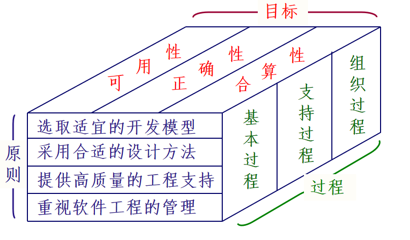

软件工程框架给出了软件工程三个主要方面。
软件工程目标—包括可用性、正确性和合算性，规定了软件工程实践的结果（即软件）应具有的基本性质；
软件工程过程—包含的基本活动有需求、分析与设计、实现、确认与测试、维护与支持；
软件工程的四条原则--采用适宜的开发模型，使用恰当的开发方法，提供高质量的工程支持，实施有效的工程管理，从四个方面指导每一项工程的活动，以实现软件工程目标。

###  软件工程的知识结构

2001年5月ISO/IEC JTC 1发布了《 SWEBOK指南V0.95（试用版）》，即 Guide to the Software Engineering Body of Knowledge。
SWEBOK把软件工程学科的主体知识分为10个知识领域。这10个领域包括：
     软件需求                        软件设计
     软件构造                        软件测试
     软件维护                        软件配置管理
     软件工程管理                软件工程过程
     软件工程工具和方法    软件质量

## 1.4 软件工程过程与软件生存周期

ISO 9000定义：软件工程过程是把输入转化为输出的一组彼此相关的资源和活动。
从软件开发的观点看，它就是使用适当的资源（包括人员、硬软件工具、时间等），为开发软件进行的一组开发活动，在过程结束时将输入（用户要求）转化为输出（软件产品）。

软件工程过程定义了: 方法使用的顺序、要求交付的文档资料、为保证质量和适应变化所需要的管理、软件开发各个阶段完成的里程碑。
软件工程过程包含四种基本的过程活动：
 plan : 软件规格说明
 do : 软件开发
 check : 软件确认
 action : 软件演进

软件生存周期包含三个阶段：软件定义、软件开发及软件运行维护。
软件生存周期模型是软件工程思想的具体化，是跨越软件生存周期的系统开发、运行、维护所实施的全部活动和任务的过程框架。
常用的软件生存周期模型有瀑布模型，演化模型，螺旋模型，增量模型，喷泉模型，快速应用开发（ RAD ）模型。

### 瀑布模型

各项活动按自上而下，相互衔接的固定次序，如同瀑布逐级下落，每项活动均处于一个质量环（输入-处理-输出-评审）中。
阶段间具有顺序性和依赖性。
推迟实现的观点。
每个阶段必须完成规定的文档；每个阶段结束前完成文档审查。

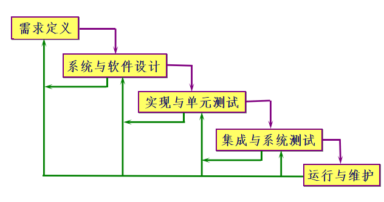

### 演化模型

演化模型是迭代的，软件必须经过不断演化才能完善。
演化模型先开发一个“原型”软件，完成部分主要功能，展示给用户并征求意见，然后逐步完善，最终获得满意的软件产品。
业务和产品需求在变化中，采用线性开发方式是不实际的。
快速实现和提交一个有限的版本，可以应付市场竞争的压力。

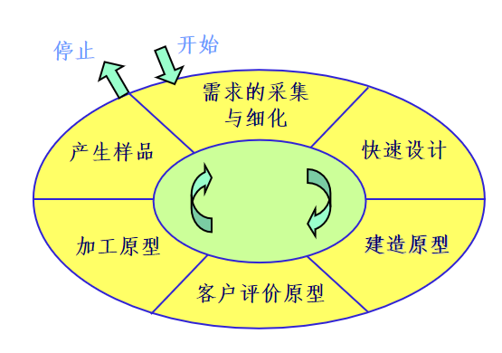

### 螺旋模型

螺旋模型将瀑布模型与演化模型结合起来，并且加入两种模型均忽略了的风险分析。
螺旋模型沿着螺线旋转，自内向外每旋转一圈便开发出更完善的一个新版本。
 制定计划
 风险分析
 实施工程
 客户评估

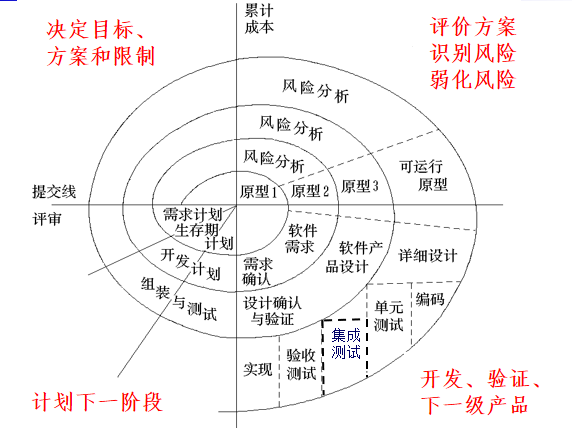

### 增量模型

增量模型是迭代和演进的过程。
增量模型把软件产品分解成一系列的增量构件，在增量开发迭代中逐步加入。
每个构件由多个相互作用的模块构成，并且能够完成特定的功能。
早先完成的增量可以为后期的增量提供服务。
增量开发方法的新演进版本叫做 "极限程序设计（eXtreme Programming）" 。

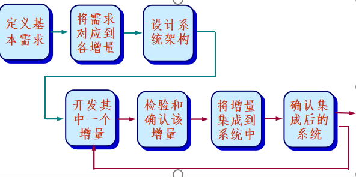

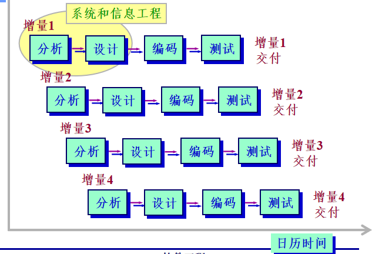

### 喷泉模式

体现了迭代和无间隙的特性。
系统某个部分常常重复工作多次，相关对象在每次迭代中随之加入演进的软件成分。
无间隙是指在各项开发活动，即分析、设计和编码之间不存在明显的边界。
喷泉模型是对象驱动的过程。

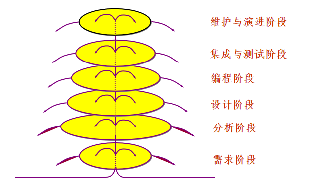

### 变换模型

变换模型是一种基于形式化规格说明语言及程序变换的软件开发模型。
它采用形式化的软件开发方法，对形式化的软件规格说明进行一系列自动的或半自动的程序变换，最终映射成为计算机系统能够接受的程序系统。
多步程序变换过程的重要性质是：每一步程序变换的正确性仅与该步变换所依据的规范 Mi 以及对变换后的假设 Mi+1 有关。

在此意义上，变换步骤独立于其他变换步骤。这称为变换的独立性。
该模型只适合于软件的形式化开发方法；需要严格的数学理论和形式化技术支持；需要一整套开发环境（如程序变换工具、定理证明工具等）的支持。 

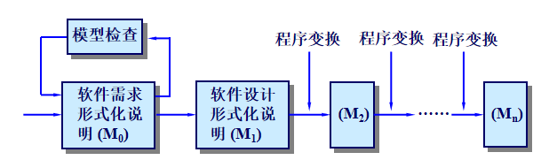

### 基于第四代技术的模型

第四代语言 (4GL) 是在大型数据库管理系统的基础上发展起来的，是一种面向结果的非过程性语言。它独立于具体的处理机，有丰富的软件工具支持，能统一利用和管理各种数据资源并能适应不同水平用户的需要。
以4GL为核心的软件开发技术成为第四代技术(4GT)，采用4GT的软件开发模型如图。
软件开发人员在定义软件需求，给出需求规格说明之后，4GT工具可将该需求规格说明自动	转换为程序代码。这大大减少了分析、设计、编码和测试的时间。
以4GL为核心的软件开发技术成为第四代技术(4GT)，采用4GT的软件开发模型如图。

### 快速应用开发（RAD)模型

快速应用开发模型是一种增量开发模型，该模型开发软件大量使用了可复用的构件。
每一个增量的开发经历五个阶段：
业务建模  对业务功能的信息流建模。
数据建模  对业务的数据对象和关系建模。
过程建模  描述完成业务功能的数据变换。
应用生成  应用构件和自动化工具建造。
测试与反复  对新构件和接口进行测试。

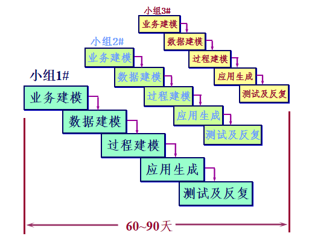

### Rational 统一开发过程

最佳软件开发实践
      为了以一种更好的、迭代的、可预测的方式开发软件产品，总结了软件开发的最佳实践：
迭代式软件开发；
需求管理；
基于构件的软件体系结构；
建立软件可视化模型；
不断验证软件质量；
控制变更。

Rational统一开发过程
      软件开发过程的作用是：
成为开发组活动顺序的向导。
详细说明需要开发哪些制品，何时开发。
指导每一个成员及整个开发组的工作。
提供监控和度量项目产品和活动所依据的准则。
如果没有一个良好定义的过程，开发组将各行其是，开发成功与否完全依赖个别优秀的人才，这不是能够长久的。

Rational统一开发过程（RUP, Rational Unify Process）描述了如何在软件开发组织中严格分配任务和职责的方法。
RUP 是一个过程产品，"软件过程也是软件。"
RUP 采用二维的过程结构：
横轴表明过程的生存周期，它反映了过程被激活时的动态情况，用周期、阶段、迭代和里程碑表示。
纵轴表明过程的静态状况，通过过程构件、活动、工作流、制品和工作人员描述过程。

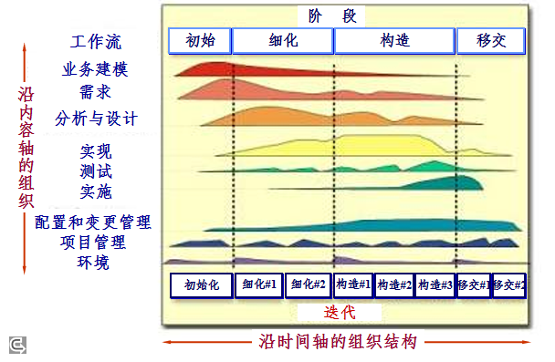

过程的静态描述：过程模型
       过程模型中的主要模型元素有 4 种：
工作人员：谁做（Who）
活动：怎么做（How）
制品：做什么（what）
工作流：何时做（when）
过程的中心概念是工作人员，工作人员不是指某一个人，而是指完成工作的角色。工作人员定义人们应履行的行为和职责。

活动定义了工作人员所执行的工作。有 3 类步骤：
思考步骤
执行步骤
评审步骤
制品是过程生产、修改或使用的一些信息。RUP 的制品分为 5 个信息集。
管理集：计划制品、操作制品
需求集：构想文档、项目相关人员需求、用例模型和业务模型

设计集：设计模型、软件体系结构描述、测试模型
实现集：源代码和可执行程序、相关数据结构和数据文档
实施集：安装资料、用户文档、培训材料
工作流用来描述生成结果的活动序列，用以描述工作人员之间的交互。在 RUP 中共有 9 个核心过程工作流，包括 6 个核心工程工作流和 3 个核心支持工作流。

业务建模工作流：描述业务过程的本质和执行情形。
需求工作流：定义系统构想，使用用例模型和补充规格说明定义系统软件需求，管理系统范围和需求变更。
分析和设计工作流：研究实现环境和系统构件的效用，定义软件的组织结构，把需求获取结果转化为实现规格。
实现工作流:   建立代码的分层结构，实现类和对象，进行单元测试和系统集成。

测试工作流：根据事先定义的度量和准则检查产品，确认产品是否满足或者超出事先定义并被一致接受的需求。
实施工作流：在实际使用环境中测试软件、包装要交付的软件、发布软件产品、培训最终用户及销售人员。
核心支持工作流有
项目管理工作流
配置和变更管理工作流
环境工作流

过程的动态描述：迭代开发
将一个大项目分解为可连续应用瀑布模型的几个小部分。在对一部分进行分析、设计、实现并确认后，再对下一部分进行分析、设计、实现和确认。以此进行下去，直到整个项目完成。在 RUP 中，迭代过程分为几个阶段。

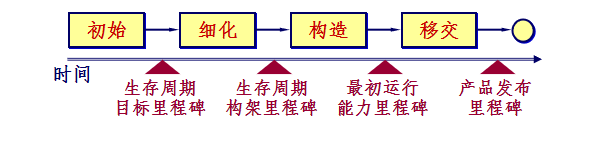

初始阶段：确定最终产品的构想及其用例，定义项目范围。
细化阶段：计划需完成活动和资源，详细说明产品特性并设计软件体系结构。
构造阶段：构造整个产品，逐步完善软件体系结构和计划，直到产品（完整的构想）已完全准备好交付给用户。
移交阶段：移交产品给用户，包括制造，交付，培训，支持及维护产品。

这 4 个阶段构成开发周期，周期结束时产生一代新的软件产品。
软件产品产生于初始开发周期，随着重复执行同样的过程，软件发展到下一代产品，这一时期即为软件的进化周期。

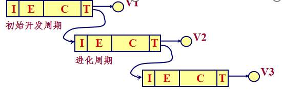

Rational统一过程的特点：
用例驱动的、以体系结构（架构）为中心的、迭代和增量的过程。
用例建模技术可以用为大多数项目相关人员理解的形式来表述问题。
参与者（Actor）
用例（Use Case）
场景（scenario）
事件流（event flow）

用例和参与者的事例
   银行储户通过自动取款机（自动柜员机）提款，转账或检查账户余额。用一组用例表达如下：

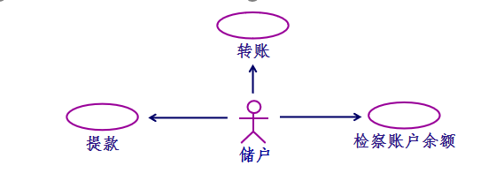

用例模型
将整个系统或子系统的所有用例，以及与之交互的参与者集合起来构成系统的用例模型。
用例模型给出系统预期功能模型和系统上下文环境模型，它成为开发人员和用户之间的契约。
用例模型的目的是确保系统能处理所有的功能性需求。

用例驱动的过程
“用例驱动” 指开发过程是基于用例，从一个工作流向下一个工作流，逐步前进的。
开发初期，人们使用用例获取用户需求，建立用例模型，描述系统的全部功能。
基于用例模型，人们创建一系列实现这些用例的分析模型、设计模型和实现模型。
测试人员测试实现确保系统正确实现了用例。

以体系结构为中心的过程
用例的选择不是孤立的，它与软件的体系结构是密切相关的。
软件体系结构的作用与一个建筑的体系结构类似。对于一个建筑，可以从框架结构、供热、上下水、供电、天然气、其他服务管线等不同角度来考察它。使得施工人员在施工前就能全面了解这个建筑。
软件的体系结构也从不同角度描述了即将构造的系统，包括系统的静态特征和动态特征。

每一种产品都有功能和表现形式两个方面。用例就是功能，体系结构就是表现形式。
在开发过程中，必须兼顾功能和表现形式，做出适当权衡，才能得到好的产品。因此，用例和体系结构必须在迭代中并行演进。
为了找到可以演进的体系结构，设计师必须从全面了解系统的主要功能（即主要用例）入手。

## 1.5 软件开发范型(Paradigm)

范型又称为风范。通常认为范型就是开发模型(Model)或开发模式(Pattern)，实际上它与方法(Methodology)一样，都被视为一种开发技术。范型支配了设计方法、编码语言、测试和检验技术的选择。
过程性范型把软件视为处理流，定义成由一系列步骤构成的算法。每一步骤都是带有输入和输出的一个过程，把这些步骤串联在一起可产生贯通于整个程序的控制流。

面向对象范型把标识和模型化问题领域中的实体做为系统开发的起点，面向对象系统中的对象是数据抽象与过程抽象的综合。
逻辑性范型是基于规则的，它把有关问题的知识分解成一组具体规则(如prolog语言)。
面向进程范型把一个问题分解成独立执行的模块。让不只一个程序同时运行。这些进程互相配合，解决问题。
面向存取范型是一种在构造用户界面方面很有用的技术。

函数型范型是基于规则的，它把有关问题的知识分解成一组具体规则，用语言的“if_then”等结构来表示这些规则。 
说明性范型。
每种开发范型都有它的支持者和用户：
每种开发范型都特别适合于某种类型的问题或子问题；
每种开发范型都用不同的方式考虑问题；
每种开发范型都使用不同的方法来分解问题

每种开发范型都导致不同种类的块、过程、产生规则。
系统开发时通常把大型问题分解成一组子问题。对于每个子问题采用适当的软件开发范型。

## 1.6 软件工程原则

软件工程原则有：
抽象与自顶向下、逐层细化    采用分层抽象的方法，有效控制软件开发的复杂性。
模块化    把问题分解为若干较小的较易解决的模块，有助于信息隐蔽和抽象。
信息隐蔽和数据封装    将模块中的软件设计决策封装在模块内部，使得模块实现与使用分离，有助于控制修改局部化。抽象与自顶向下、逐层细化

局部化    在一个物理模块内集中逻辑上相互关联的计算机资源，促使聚合具有特定目的的事物。
一致性    整个软件系统的模块使用一致的设计策略、编程风格，保持程序内部接口的一致性、软件与硬件接口的一致性、系统规格说明与系统行为的一致性。
完备性    软件系统中不丢失任何成分。
可验证性    系统分解应当遵循易检查、易测试和易评审的原则，以保证系统的正确性。

软件工程的基本原理有：
按软件生存期分阶段制定计划并认真实施    把整个软件开发过程视为一项工程，把工程划分为若干阶段，分别制定每个阶段的计划，逐个实施。
坚持进行阶段评审    前一阶段的结果将成为下一阶段的依据。坚持阶段的评审才能保证错误不传播到下一阶段。

坚持严格的产品控制    将影响软件质量的因素在整个过程中置于严格控制之下。
使用现代程序设计技术    先进的程序设计技术带来的是生产率和质量的提高。使用合适的开发模式和工具可以有效地建立功能强大的系统。
明确责任，使得工作结果能够得到清楚的审查    开发组织严格划分责任并制定产品的标准，使得每个成员的工作有据可依，确保产品的质量。

用人少而精    开发组织不在人多，在于每个人的技能适合要求。同时用人少而精，可减少沟通路径，提高生产率。
不断改进开发过程    在开发的过程中不断总结经验，改进开发的组织和过程，有效地通过过程质量的改进提高软件产品的质量。

