# 第二章  计算机系统工程

2.1 基于计算机的系统
2.2 计算机系统工程
2.3 系统分析与结构设计
2.4 可行性研究
2.5 其他系统描述方法

## 2.1 基于计算机的系统

某些元素的一个集合或排列，这些元素被组织起来以实现某种方法，过程或借助处理信息进行控制。基于计算机系统的系统元素：

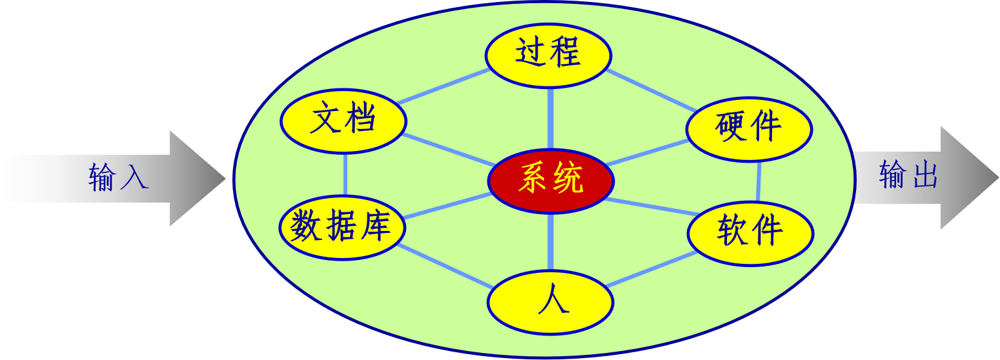

### 计算机系统的系统元素

软件 — 计算机程序、数据结构、相关文档
硬件 — 电子计算设备（如CPU， 存储器）和外部机电设备（如传感器、马达等）
人 — 硬件和软件的用户
数据库 — 一个大型的有组织的信息集合
文档 — 手册、表格和其它用以描述系统使用和操作的信息
过程 — 定义每一种系统元素的特定使用步骤，或系统驻留的过程性环境

### 计算机系统的层次结构

基于计算机的系统本身可以成为一个更大的基于计算机系统中的一个元素，并称为那个更大系统的宏元素。例如：

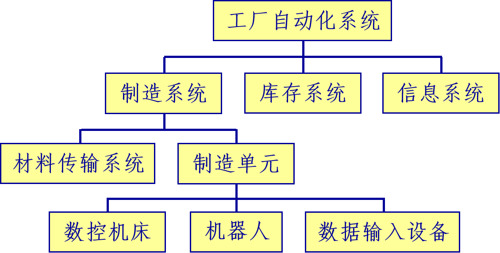

## 2.2 计算机系统工程

计算机系统工程是一个问题求解活动，目的是揭示、分析所期望的功能，并把它们分配到各个单独的系统元素中去。
系统工程师的任务是：
与用户合作确认用户的目标和约束
导出功能、性能、接口、设计约束和信息结构的表示
将它们分配到每一个系统元素中

### 系统过程的实施

识别用户要求
评价系统的可行性
进行经济分析和技术分析
把功能分配给硬件、软件、人、数据库和其它系统元素
建立成本和进度限制
生成系统规格说明，形成所有后续工程的基础

### 识别用户要求

系统工程的第一步就是识别用户要求
分析员必须考虑以下问题：
功能和性能
可靠性和质量
总的系统目标
为此，必须了解系统应解决的问题，这些问题是如何提出的
设想这些问题如何解决才能满足要求
了解问题的结构

对同一功能，可以分配给不同的系统元素。为了选取一种最有效的分配方案，应对每一方案使用一组权衡准则进行评价。
此外，还要考虑：
成本与进度限制
制造需求
市场与竞争情况
有效的技术
将来可能的扩充

为选取最有效的分配方案，使用一组权衡准则进行评价
项目考虑
商业考虑
技术分析
生产评估
人员问题
环境界面
法律考虑

项目考虑
在预估的成本与进度范围内所选的系统配置能否实现？
与成本与进度估算相关的风险有哪些？
商业考虑
所选的系统配置是最可能有效益的解决方案吗？
能否成功地占领市场？
最终的报偿是否能表明所冒的开发风险是值得的？

技术分析
是否具备开发所有系统元素的技术实力？
能否确保功能和性能得到满足？
能否对这种系统配置进行充分的维护？
是否具备技术资源？
与技术相关的风险有哪些？
生产评估
生产工具与设备是否有效？
必需的过程是否短缺？
是否充分地实施了质量保证？

人员问题
开发人员是否得到培训？
是否存在政治问题？
用户是否了解这个系统将要做什么？
环境界面
所提交的系统配置与系统的外部环境的接口是否合适？
机器与机器、人与机器之间的通信是否以智能方式处理？

法律考虑
这种配置是否会引入违法的责任风险？
对责任问题是否给予了足够的保护？
是否存在潜在的破坏问题？

一旦将功能和性能分配给每一个系统元素，系统工程师将通过硬件工程、软件工程、人类工程和数据库工程等建立相应系统元素的需求模型，确定其功能和性能范围，接口要求。

### 硬件和硬件模型

计算机系统工程师选择硬件元件的某种组合以构成基于计算机系统的硬件元素
通过硬件需求分析，为硬件的所有元件确定精确的功能、性能和接口需求。以及设计约束条件（如尺寸，环境）及测试准则。
设计一个初步的硬件配置方案，包括通信协议、拓扑结构等。
确定质量需求，包括安全性、可靠性、可用性等方面的质量标准。

### 软件与软件模型

为实现要求的功能和性能，必须制作或获取一系列软件部件
软件元素分为两类
通过软件需求分析，确认分配给软件的功能和性能。
按照功能分解的结果，提出软件系统分解为一系列子系统的构想，描述各子系统的功能和性能要求，以及各子系统之间的交互。
各子系统在硬件系统中的部署情况。

### 人类工程

是应用从心理学和方法论导出的知识来确定和设计高质量HCI的多学科活动
根据分配给人的各项活动，建立人员活动（任务）网络图，描述人机交互的环境。
根据用户分类和每一类用户的特点，针对用户要求的每一个动作和机器产生的每一个动作，建立“对话”方式构想。
设计用户界面原型，将硬件、软件和其他系统元素组合起来形成简化的用户环境，模拟和评价人机交互的所有步骤。

### 数据库和数据库模型

数据库工程（包括数据库分析、设计和实现）
对于使用数据库的系统，信息仓库往往是所有功能的核心
系统工程师建立数据库模型：
定义数据库中包含的信息，查询的类型，数据存取的方式和数据库的容量等。
如果使用多个数据库管理系统，还要描述它们之间的数据转换方式和必要的数据结构。

### 可行性研究

可行性研究从
经济
技术
法律
用户操作
等方面分析所给出的解决方案是否可行。
这是项目立项的依据。只有当解决方案可行且有一定经济效益或社会效益时才能开始系统开发。 

### 建立成本和进度的限制

开发一个基于计算机的系统必须有足够的资金投入和（交付）时间约束，这是与客户在合同或任务书中已经达成协议的。
因此，在系统工程阶段必须进行
任务分解
成本估算
进度安排
资源计划 

### 生成系统需求规格说明

系统需求规格说明是在后续阶段中开发硬件系统、软件系统、数据库系统和人机接口系统的时候使用的一个文档。
它描述了一个基于计算机系统的功能和性能，以及管理该系统开发的一些限制条件。
它界定每个被分配的系统元素。例如，它给软件工程师指明了软件在整个系统和各种子系统环境中的作用。系统需求规格说明还描述了系统的输入／输出（数据与控制）信息。 

## 2.3 系统分析与结构设计 

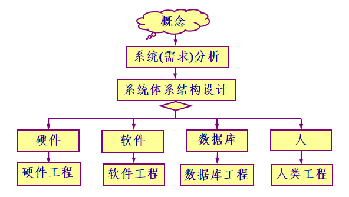

### 硬件工程阶段

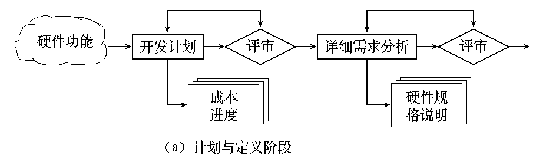

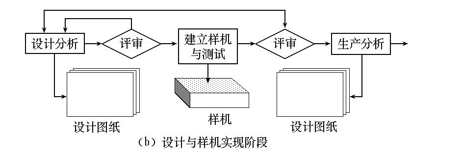

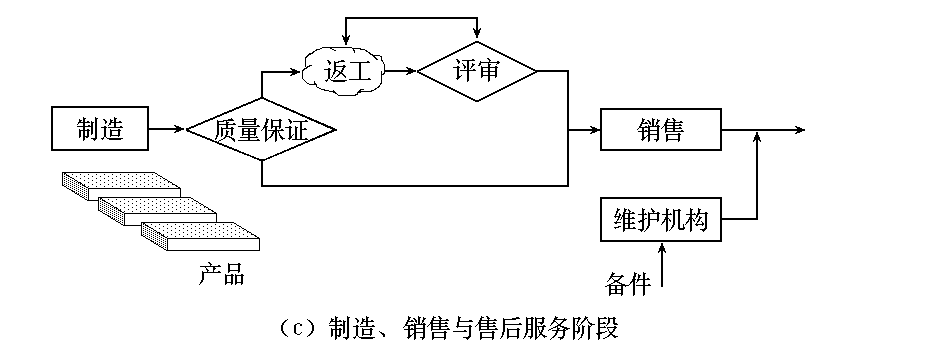

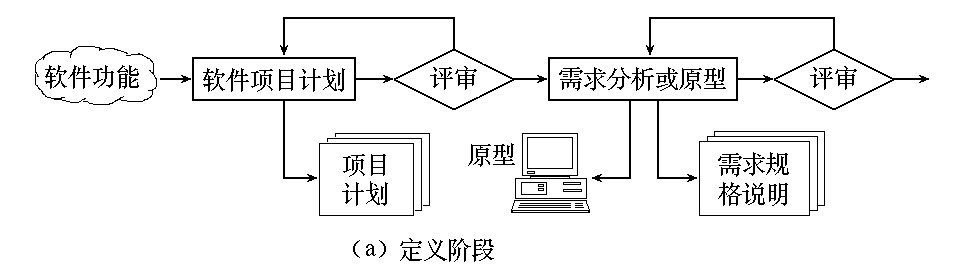

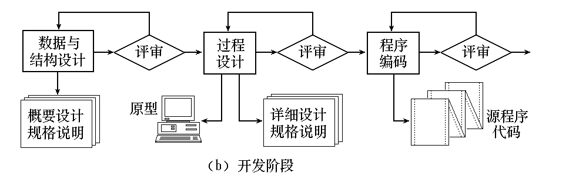

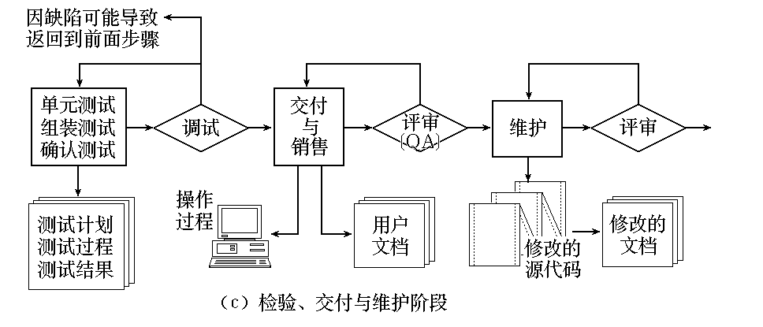

### 系统分析和结构设计的主要活动

分析待开发系统的特定的预期使用要求，以规定系统需求
系统需求规格说明应描述：
系统的功能与性能；
业务、组织和用户需求；
安全性、保密性、人类工程（人机工程学）、接口、运行和维护需求；
设计限制和鉴定需求。
系统需求规格说明应形成文档。

根据评价准则评价系统需求，并将评价结果形成文档
评价准则包括：
获取需要的可追溯性；
获取需要的一致性；
可测试性；
系统结构设计的可行性；
运作和维护的可行性。

3. 建立系统的顶层结构

结构中应标出硬件配置、软件配置和人工操作过程等系统元素。
应确保所有系统需求都已分配到各个系统元素中。
分配到各个系统元素中的系统需求和系统结构应形成文档。
根据评价准则评价这些系统元素的系统需求和结构，并将评价结果形成文档
评价准则包括：

系统需求的可追溯性；
与系统需求的一致性；
所使用的设计标准和方法的适宜性；
软件部分满足指定需求的可行性；运行和维护的可行性。

### 业务过程建模

业务过程建模的目的是定义一个能有效利用信息进行业务活动的体系。
从企业信息技术需求的全局角度出发，不仅需要说明适用的计算体系架构，还需要开发适用于企业计算资源的特定配置的软件系统架构。
数据体系架构
应用体系架构
技术基础设施  

### 数据体系架构

数据体系架构描述业务功能的信息需求。
架构的基本单元是业务对象。一个业务对象包括一组属性以及对质量、特征或数据的描述。
数据体系架构还要描述业务对象之间的关系。关系表明对象之间是如何相联系的。
例如，“消费者”和“产品A”两个对象之间可以通过“购买”关系发生联系。
在业务活动中流动的数据对象可以通过数据库组织起来，为业务需要提供所需的信息。

### 应用体系架构

应用体系架构描述为实现某些业务需求，在数据体系架构范围内参与数据加工的那些组件构成的系统。
从软件工程角度可认为应用体系架构就是执行变换的程序（软件）系统。
从更广泛的意义来看，应用体系架构应当将人员角色（信息的变换者和使用者）和待实现的业务过程联系在一起。

### 技术基础设施

技术基础设施为数据体系架构和应用体系架构提供组织基础。
基础设施包括用来支持应用和数据的硬件和软件，包括计算机、操作系统、网络、通信链路、存储技术和用于实现这些技术的体系结构（如客户／服务器）。 

### 产品工程

产品工程的目的是将用户期望的业经定义的一组能力转化为实际产品。
为此，产品工程也要给出系统架构和基础设施。这个系统架构包括 4 个系统构件：
软件
硬件
数据（数据库）
人员
基础设施则包括能集成各种构件的技术和用于支持构件的信息（如文档、CD—ROM、视频）。 

### 产品工程层次图

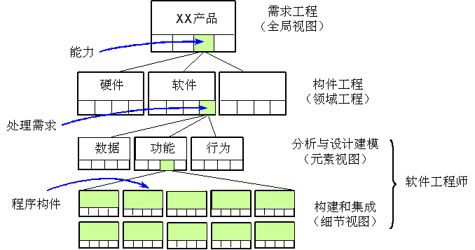

全局视图由需求工程得到。
全局性需求由客户提出，包括
信息和控制要求
产品功能和行为
产品整体性能
设计和接口约束条件
其他特殊要求。
一旦这些需求确定下来，需求工程的工作就是将这些功能和行为分配到上述 4 个系统构件中。

系统构件工程是一组并发活动，分别处理
软件工程
硬件工程
人类工程
数据库工程
这些系统构件。
特别需要重视
各个系统构建的工程规范的建立
维持相互之间的积极沟通，需求工程要建立便于沟通的接口机制。

对软件工程来说，需要进行分析和设计建模活动，以及包括编码、测试和支持任务在内的构造和部署活动。
分析的任务是使用数据、功能和行为模型来描述需求
设计的任务是将分析模型映射到数据设计、结构设计、接口设计和软件构件级设计中。 

### 系统模型模板

为了开发系统模型，使用了“结构模板”。
系统工程师把各种系统元素分配到模板内的五个处理区域：
  （1）用户界面；
  （2）输入；
  （3）系统功能与控制；
  （4）输出；
  （5）维护与自测试。

结构模板能帮助分析员建立一个细节的层次结构。结构环境图SCD(System Context Diagram) 位于层次结构的顶层。

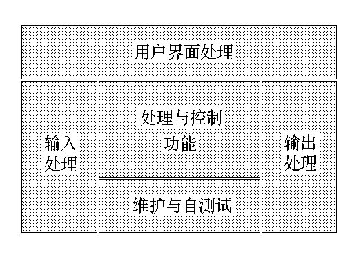

环境图建立了待实现系统与系统运行环境之间的信息边界。SCD 定义了
系统使用的所有信息的外部产生者（系统信息的来源）
由系统建立的所有信息的外部使用者（系统信息的去处）
通过接口进行通信或实施维护与自测试的所有外部实体

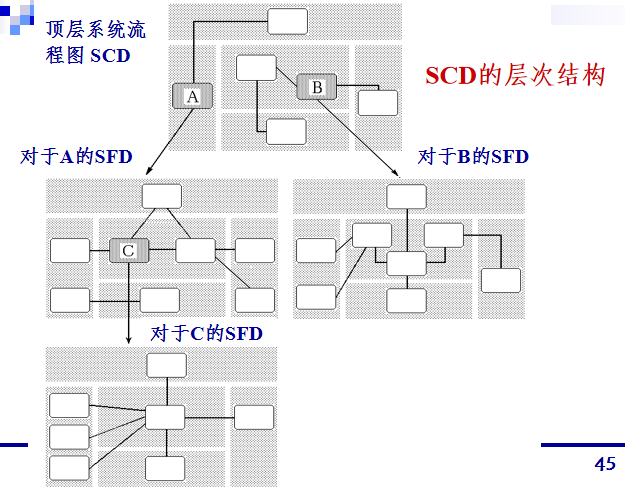

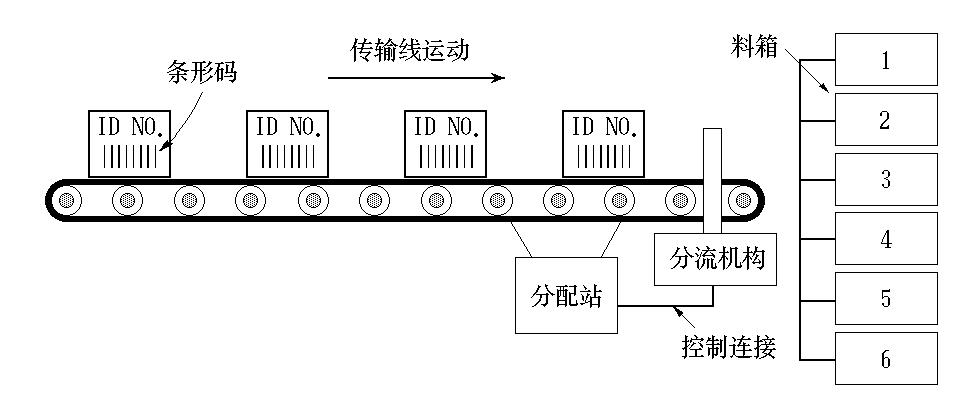

功能：⑴ 读入条形码输入信息;
	⑵ 读入脉冲计数器信号; ⑶ 译零件码数据;  ⑷数据库查询;  ⑸ 决定料箱位置;   ⑹ 对分流机构生成控制信号。

### CLSS的SCD图

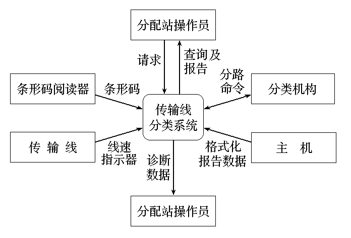

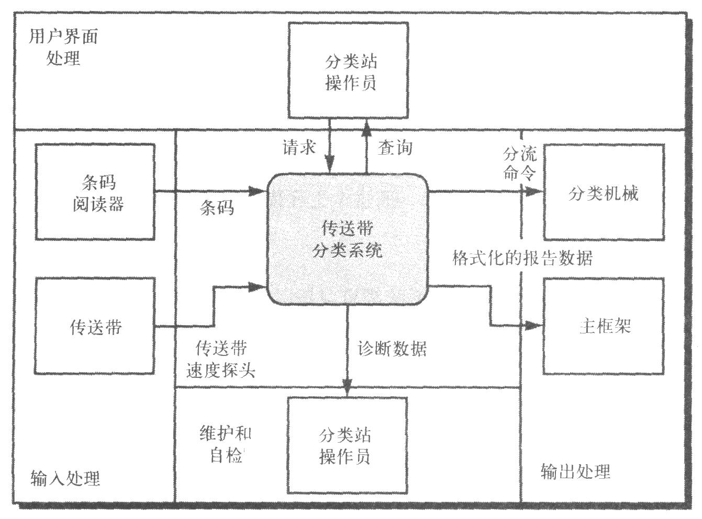

每一个方框表示一个外部实体，即系统信息的产生者或使用者。
整个系统（或位于下层的专门子系统）的符号用圆角矩形表示。因此，CLSS 在 SCD 中间的处理与控制区域内表示。
在 SCD 中附加名字的箭头表示外部实体与 CLSS 系统之间传送的（数据或控制）信息。外部实体“条形码阅读器”产生条形码输入信息。
本质上 SCD把任一系统都置于它的外部环境中

系统工程师对 SCD 图中的矩形区域详细分析，加细 SCD 图。建立各种专门子系统完成传输线分类系统的功能。
专门子系统定义在从 SCD 导出的结构流程图SFD中（System Flow Diagram）。信息流穿越 SCD 的各个区域，可用于引导系统工程师开发SFD ─ 更详细的CLSS “图解”。
结构流程图给出了各个专门子系统和重要的（数据与控制）信息流。

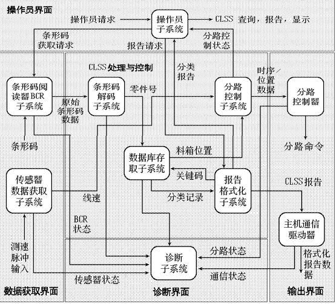

UML系统建模 

对于 CLSS 系统，用UML对 4 个重要的系统元素进行建模：
用UML部署图建立CLSS系统层次的硬件模型。
用UML活动图描述CLSS软件的操作规程，以表现系统实现各种功能时的具体步骤。
用UML类图描述系统的
用UML用例图阐述一个参与者（用小人表示）与系统的交互行为。     

### CLSS 系统的硬件部署图

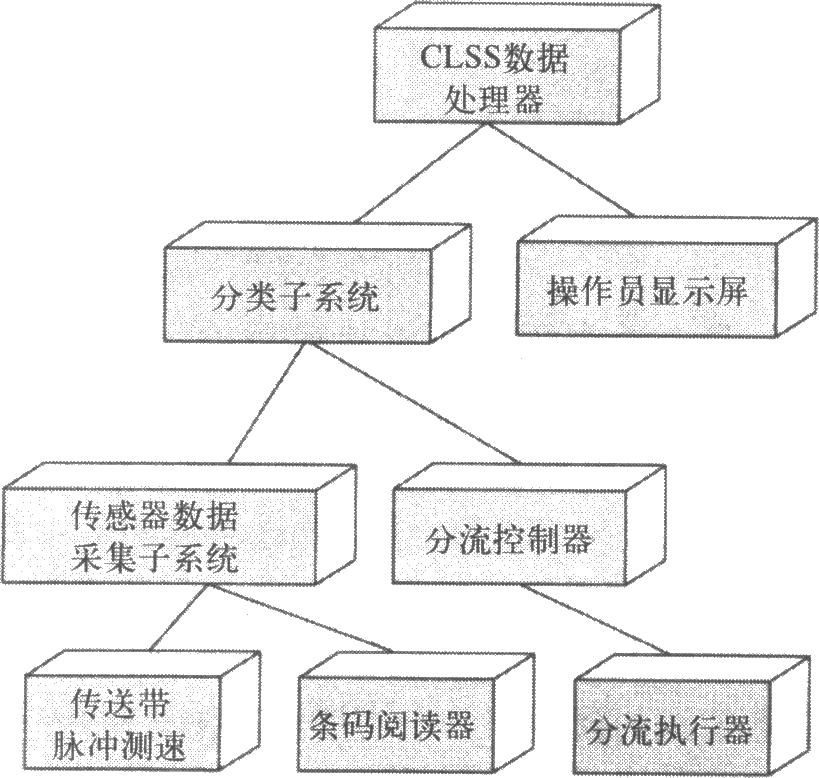

CLSS系统的活动图

CLSS系统的类图

CLSS系统的用例图

###  系统文档与评审 

系统分析与结构设计阶段应交付的文档有
系统可行性研究报告
系统／子系统需求规格说明
系统／子系统设计说明
接口需求规格说明（可选项）
接口设计说明（可选项）
在系统分析与结构设计阶段，有关软件的主要评审内容包括：

软件功能描述的正确性
软硬件功能划分的合理性和可行性
接口要求及接口设备要求的合理性
质量要求的合理性
开发环境要求的合理性和可行性
开发进度要求的合理性和可行性
软件开发技术的合理性和可行性。
软件开发成本的合理性和可行性。

###  2.4 可行性研究

问题的识别
了解系统应解决的问题，这些问题是如何提出的
设想这些问题如何解决才能满足要求
了解问题的结构
市场调查
了解市场对待开发软件的需求情况
调查市场上已有的类似软件系统的功能、性能、价格情况

分析准备
确立分析计划
规定由谁参加分析作业，任务分配
对参加分析的人员进行必要的培训
环境分析
明确系统的目的和限制条件
使用单位的状况、经营方针和组织机构
使用单位的计算机利用情况
相关的硬件、软件及其它接口部分
用户的操作环境及操作要求

习惯、法律、制度上对软件的制约
开发能具备的技术条件和设备条件
物理分析
了解实际业务活动状况，特别对一些活动要点进行分析
明确在这些要点之间什么东西在流动，如何进行流动
对物理流量进行分析
对其模型化，得到实际业务系统（当前系统）的物理模型

功能分析
决定系统应具备的功能 (工作域)
分析功能的结构：功能展开和功能分配
分析各功能之间的关系，整理它们之间传递的信息
利用数据流图，描述信息在系统流动与处理的情况
信息分析
调查系统的输入、输出、保存信息
明确信息的结构及各信息之间的关系

调查各信息的信息量
调查各种报表和文件的格式
建立粗略的数据词典，定义系统中使用的数据
动态分析
系统内每一部分有几种状态
各种状态转换的条件
同步产生的条件与同步后状态的变化
确立系统方案，进行各种估算
粗略地估算成本

估算可能取得的效益
提出可能需要的资源，包括人员、硬件、软件等
提出大概的进度安排
模型评审
将目标系统的逻辑模型提出管理部分与用户进行评审
复查问题定义、工程规模和系统目标

### 经济可行性  成本–效益分析

成本－效益分析的目的，是从经济角度评价开发一个新的软件项目是否可行。
成本－效益分析首先估算新软件系统的开发成本，然后与可能取得的效益（有形的和无形的）进行比较权衡。
有形的效益可以用货币的时间价值、投资回收期、纯收入等指标进行度量。无形的效益主要是从性质上、心理上进行衡量。

成本－效益分析的目的，是从经济角度评价开发一个新的软件项目是否可行。
成本－效益分析首先估算新软件系统的开发成本，然后与可能取得的效益（有形的和无形的）进行比较权衡。
有形的效益可以用货币的时间价值、投资回收期、纯收入等指标进行度量。无形的效益主要是从性质上、心理上进行衡量。

无形的效益（如较好的设计质量、较高的雇员素质）可以被赋予货币价值，或用于支持按劝告行事。
系统的经济效益等于因使用新系统而增加的收入加上使用新系统可节省的运行费用。

货币的时间价值
成本估算的目的，是要求对项目投资。但投资在前，取得效益在后。因此要考虑货币的时间价值。

通常用利率表示货币的时间价值。设年利率为 i，现已存入 P 元，则 n 年后可得钱数为                 
           F = P ( 1 + i )n
这就是 P 元钱在 n 年后的价值。
反之，若 n 年后能收入 F 元，那么这些钱现在的价值是

例如，在工程设计中用CAD系统来取代大部分人工设计工作，每年可节省9.6万元。

若软件生存期为 5 年，则 5 年可节省 48 万元。开发这个 CAD 系统共投资了 20 万元。
不能简单地把 20 万元与 48 万元相比较。因为前者是现在投资的钱，而后者是 5 年内相继节省的钱。
需要把 5 年内每年预计节省的钱折合成现在的价值才能进行比较。
设年利率是5％，利用上面计算货币现在价值的公式，可以算出引入CAD系统后，每年预计节省的钱的现在价值，参看下表。  

| **年份** | **将来值****(****万****)** | **(1+i)****n** | **现在值****(****万****)** | **累计现在值****(****万****)** |
| -------- | -------------------------- | -------------- | -------------------------- | ------------------------------ |
| **1**    | **9.6**                    | **1.05**       | **9.1429**                 | **9.1429**                     |
| **2**    | **9.6**                    | **1.1025**     | **8.7075**                 | **17.8504**                    |
| **3**    | **9.6**                    | **1.1576**     | **8.2928**                 | **26.1432**                    |
| **4**    | **9.6**                    | **1.2155**     | **7.8979**                 | **34.0411**                    |
| **5**    | **9.6**                    | **1.2763**     | **7.5219**                 | **41.5630**                    |

投资回收期就是使累计的经济效益等于最初的投资所需要的时间。
投资回收期越短，就能越快获得利润。
例如，引入CAD系统两年以后,可以节省17.85万元，比最初的投资还少2.15万元，但第三年可以节省8.29万元，则
	          2.15 / 8.29 = 0.259
因此，投资回收期是2.259年。

工程的纯收入就是在整个生存期之内系统的累计经济效益（折合成现在值）与投资之差。
例如，引入CAD系统之后，5 年内工程的纯收入预计是 41.563－20＝21.563（万元）。这相当于比较投资一个待开发的软件项目后预期可取得的效益和把钱存在银行里（或贷款给其它企业）所取得的收益，到底孰优孰劣。

用投资回收率来衡量投资效益的大小。
已知现在的投资额 P，并且已经估算出将来每年可以获得的经济效益Fk，以及软件的使用寿命 n，k = 1, 2, ..., n。则投资回收率 j，可用如下的方程来计算：
                       

这相当于把数额等于投资额的资金存入银行，每年年底从银行取回的钱等于系统每年预期可以获得的效益。
在时间等于系统寿命时，正好把在银行中的钱全部取光。此时的年利率是多少呢? 就等于投资回收率。

技术解决方案的实用性
使用的技术实用化程度
技术解决方案合理程度
技术资源的可用性
参与人员的工作基础
基础硬件/软件的可用性
软件工具实用性

专利法
著作权法
软件保护条例

用户类型：外行型／熟练型／专家型
操作习惯
使用单位的计算机使用情况
使用单位的规章制度

HIPO是1976年由 IBM 公司提出来的，图既是在开发过程中的表达工具，又是开发文档的编制工具。
HIPO图采用功能框图和 PDL （伪代码）来描述程序逻辑，它由两部分组成：层次图（H图）和IPO图。
层次图给出程序的层次关系，IPO图为程序各部分提供具体的工作细节。

层次图 (H图) 表明各个功能的隶属关系。它是自顶向下逐层分解得到的。
最高一层是整个系统的名称和系统的概括功能说明；
第二层把系统功能展开，分成几个框；
第二层功能进一步分解，就得到了第三层、第四层，…，直到最后一层。
每个框内都应有一个名字，用以标识它的功能。还应有一个编号，以记录它所在的层次及在该层次的位置。

| **编号**  | **说        明**                                             |
| --------- | ------------------------------------------------------------ |
| **1.0.0** | **销售****/****盘存处理框图**                                |
| **1.1.0** | **顾客订单检查****,** **核对顾客赊欠金额****,** **产生销售报表** |
| **1.1.1** | **用工作文件的盘存项目号****,** **对顾客订单进行核对和排序** |
| **1.1.2** | **以地区和人员为单位****,** **编制销售报表****,** **计算销售佣金** |
| **1.1.3** | **检验顾客赊欠金额****,** **计算折扣****,** **确定支付项目** |
| **1.2.0** | **处理顾客盘存管理报表****,** **顾客付款收帐****,** **处理发货、包装、托运** |
| ****    | ** **                                                        |

IPO图为层次图中每一功能框详细地指明输入(I)、处理(P)及输出(O)。
通常，IPO图有固定格式，处理操作部分总是列在中间，输入和输出部分分别在其左边和右边。
由于某些细节很难在一张IPO图中表达清楚，常常把IPO图又分为两部分：
概括的称为概要图（overview diagram）
具体的称为详细图（detail diagram）。

概要IPO图用于表达对一个系统，或对其中某一子系统功能的概略表达，指明完成某一功能框规定的功能时需要哪些输入，哪些操作和哪些输出。
详细IPO 图详细表明输入、处理、输出三者之间的关系。输入和输出应是确定的文件和记录，或是文件和记录中的字段，以及具体介质和设备类型，处理框中的操作也应是具体的而不是含糊的，调用子程序时应标明子程序名。  

